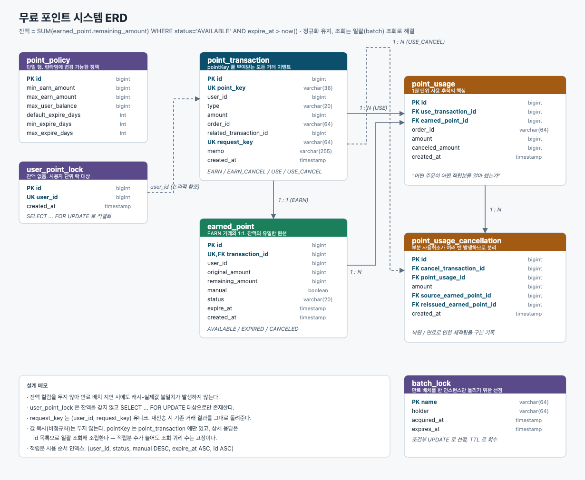

# 무료 포인트 시스템 (API)

무신사페이먼츠 Backend Engineer 과제. 무료 포인트의 **적립 / 적립취소 / 사용 / 사용취소**를 제공하는 REST API입니다.

포인트는 금전과 동일하게 다뤄야 하므로, 이 구현의 최우선 목표는 **어떤 시점에도 잔액과 원장이 어긋나지 않는 것**입니다. 그 목표에서 나온 설계 결정들을 아래 [핵심 설계 결정](#6-핵심-설계-결정)에 정리했습니다.

---

## 1. 개발 환경

| 항목 | 버전 |
|---|---|
| Java | 21 (Temurin) |
| Spring Boot | 3.5.16 |
| DB | H2 (in-memory) |
| Build | Gradle 8.14.3 (Kotlin DSL, wrapper 포함) |
| API 문서 | springdoc-openapi 2.8.9 (Swagger UI) |

---

## 2. 빌드 및 실행

별도 설치 없이 저장소에 포함된 Gradle wrapper로 실행됩니다. JDK 21만 있으면 됩니다.

```bash
./gradlew clean build
```

```bash
./gradlew bootRun
```

실행 후 접속 경로:

| | URL |
|---|---|
| Swagger UI | http://localhost:8080/swagger-ui.html |
| OpenAPI 스펙 | http://localhost:8080/v3/api-docs |
| H2 콘솔 | http://localhost:8080/h2-console (JDBC URL: `jdbc:h2:mem:point`, User: `sa`, 비밀번호 없음) |

테스트만 실행하려면:

```bash
./gradlew test
```

---

## 3. 요구사항 구현 현황

| # | 요구사항 | 구현 |
|---|---|---|
| 3-1-1 | 1회 적립 1P 이상 10만P 이하, **하드코딩 아닌 방법으로 제어** | `point_policy` 테이블 + 관리자 API. 초기값은 `application.yml` |
| 3-1-2 | 개인별 최대 보유금액 제한, **별도 방법으로 변경 가능** | 동일. `PUT /api/v1/admin/points/policies` 로 무중단 변경 |
| 3-1-3 | 적립분이 **어떤 주문에서 1원 단위로** 사용됐는지 추적 | `point_usage` (적립분 × 사용거래 × 주문번호 × 금액) |
| 3-1-4 | 관리자 수기지급분을 다른 적립과 **구분 식별** | `earned_point.manual` + 전용 엔드포인트 `POST /api/v1/admin/points/earn` |
| 3-1-5 | 만료일 최소 1일 ~ **5년 미만**, 기본 365일 | 정책값(`min/max/defaultExpireDays`). 5년 미만은 시스템 불변식으로 상한 고정 |
| 3-2-1 | 적립 취소는 전액만, **일부라도 사용됐으면 불가** | `EarnedPoint.cancel()` 에서 `remaining == original` 검증 |
| 3-3-1 | 주문 시에만 사용 | 사용 API가 `orderId` 필수 |
| 3-3-2 | 사용 시 주문번호 기록 | `point_transaction.order_id` + `point_usage.order_id` |
| 3-3-3 | **수기지급 우선 → 만료임박 순** 사용 | `ORDER BY manual DESC, expire_at ASC, id ASC` |
| 3-4-1 | 전체 또는 일부 사용취소 | 부분취소 누적 지원 (`canceled_amount`) |
| 3-4-2 | 취소 시점에 **이미 만료된 적립분은 신규적립 처리** | 복원 불가 시 새 EARN 거래 + 새 적립분 생성 |

과제 명세 4장의 예시(A~E 전체 흐름)는 [`PointScenarioTest`](src/test/java/com/musinsa/payments/point/PointScenarioTest.java) 에 그대로 재현되어 있습니다.

산출물:

- ERD — [`resource/erd.png`](resource/erd.png) ([SVG](resource/erd.svg))
- AWS 아키텍처 (옵션) — [`resource/aws-architecture.png`](resource/aws-architecture.png) ([SVG](resource/aws-architecture.svg))

---

## 4. 도메인 모델



| 테이블 | 역할 |
|---|---|
| `point_transaction` | **pointKey를 부여받는 모든 거래 이벤트**. EARN / EARN_CANCEL / USE / USE_CANCEL |
| `earned_point` | EARN 거래와 1:1. `remaining_amount`, `expire_at`, `manual`, `status` 보유. **잔액의 유일한 원천** |
| `point_usage` | 사용 상세. "어떤 사용거래가 어떤 적립분을 어떤 주문에서 얼마 썼는가" — 1원 단위 추적의 핵심 |
| `point_usage_cancellation` | 사용취소 상세. 어느 적립분으로 돌아갔는지, 만료로 새로 적립했는지 기록 |
| `user_point_lock` | **잔액 컬럼 없음.** 사용자 단위 락(`SELECT ... FOR UPDATE`) 대상으로만 존재 |
| `point_policy` | 단일 행. 런타임에 변경 가능한 정책값 |

`earned_point.status` 는 `AVAILABLE` / `EXPIRED` / `CANCELED` 3가지입니다. 잔액이 0이 되는 것은 상태 전이가 아니라 `remaining_amount` 값 변화로만 표현해, 상태 머신을 단순하게 유지했습니다.

`point_usage` / `point_usage_cancellation` 은 **조회 전용 원장 행**입니다. 그래서 응답에 필요한 값(`earned_point_key`, `earned_point_manual`, `earned_point_expire_at` 등)을 거래 시점 그대로 담습니다. 전부 `earned_point` 의 불변 컬럼을 복사한 것이라 원본과 어긋날 수 없고, 대신 사용/취소 상세 조회가 조인 없이 한 번에 끝납니다. ERD에서 갈색으로 표시한 컬럼들입니다.

DDL과 인덱스는 [`src/main/resources/db/schema.sql`](src/main/resources/db/schema.sql) 에 있습니다.

---

## 5. 계층 구조

`controller → service → repository` 입니다. facade 는 두지 않았습니다. 컨트롤러 메서드 11개 전부가 서비스 메서드를 **정확히 하나만** 호출하므로, facade 를 넣으면 위임만 하는 층이 하나 늘어날 뿐입니다. 한 요청이 여러 서비스를 조율해야 하는 순간이 오면 그때 facade 를 넣는 게 맞다고 봤습니다.

지키는 규칙은 세 가지입니다.

**엔티티는 서비스 계층을 벗어나지 않습니다.** 컨트롤러 반환 타입은 전부 DTO 클래스이고, `service/dto` 의 어떤 클래스도 엔티티를 import 하지 않습니다. 예전에는 `PolicyResult.of(PointPolicy)` 처럼 응답 DTO 가 엔티티를 알고 있었는데, 매핑을 `PointPolicyService` 안으로 옮기고 DTO 는 값만 담게 되돌렸습니다.

**서비스가 다른 서비스를 호출하지 않습니다.** `PointEarnService` / `PointUseService` 가 정책을 읽으려고 `PointPolicyService` 를 호출하고 있었는데, `PointPolicyReader` 를 두고 그쪽을 보게 했습니다. `EarnedPointReader`, `PointTransactionReader` 와 같은 결입니다 — 리포지토리를 감싸 도메인 예외를 던지는 서비스 계층 조회 담당입니다.

**컨트롤러는 리포지토리도 설정도 보지 않습니다.** 만료 배치 청크 크기를 컨트롤러가 `PointExpirationProperties` 에서 꺼내 넘기고 있었는데, 서비스가 직접 읽도록 바꿨습니다.

의존 방향은 전부 안쪽(도메인)을 향합니다.

```
api ────────► service ────────► repository ────────► domain
 │                │                                    ▲
 └────────────────┴────────────────────────────────────┘
```

`api → domain` 이 한 군데 있습니다. `UpdatePolicyRequest.toValues()` 가 도메인 값 객체 `PointPolicyValues` 를 만드는 부분입니다. 엔티티도 응답도 아니고 방향이 안쪽이라 그대로 뒀습니다. 이걸 없애려면 같은 6개 필드를 가진 레코드를 서비스 계층에 하나 더 만들어야 하는데, 중복을 늘리는 대가가 더 크다고 판단했습니다.

---

## 6. 핵심 설계 결정

### 6-1. 잔액을 컬럼으로 저장하지 않는다

`user_point_lock.balance` 같은 캐시 컬럼 없이, 잔액은 항상 이렇게 계산합니다.

```sql
SELECT COALESCE(SUM(remaining_amount), 0)
FROM earned_point
WHERE user_id = ? AND status = 'AVAILABLE' AND expire_at > now()
```

만료는 시각이 지나면 발생하는데 컬럼 차감은 배치가 돌아야 반영됩니다. 잔액 컬럼을 두면 그 사이에 이미 만료된 포인트가 사용 가능한 것처럼 보입니다. 계산식에 `expire_at > now()` 가 들어 있으면 배치와 무관하게 항상 정확합니다.

적립분이 수만 건까지 쌓이면 합산 비용이 문제가 됩니다. 그때는 스냅샷 테이블을 두되 원장을 정본으로 유지하는 방향이 맞다고 봅니다.

### 6-2. `user_point_lock` 은 잔액이 아니라 락을 위해 존재한다

검사와 반영 사이가 원자적이어야 하므로, 네 가지 연산 모두 진입부에서 사용자 행을 먼저 잠급니다.

```java
userPointLocker.lock(userId);   // SELECT ... FOR UPDATE
```

사용자 단위 락이라 다른 사용자끼리는 경합하지 않습니다. 락 행이 없는 최초 요청은 `MERGE INTO user_point_lock ... KEY(user_id)` 로 처리합니다. 동시에 들어와도 뒤에 온 트랜잭션이 앞선 커밋을 기다렸다가 같은 행을 잠그므로 예외 처리 없이 직렬화됩니다.

> 처음엔 `REQUIRES_NEW` 중첩 트랜잭션으로 락 행을 만들었는데, 요청 하나가 커넥션 2개를 잡아 동시 요청이 풀 크기를 넘으면 교착에 빠졌습니다. 동시성 테스트에서 드러나 upsert 로 교체했습니다. (`MERGE ... KEY` 는 H2 문법이라 MySQL 에선 `INSERT ... ON DUPLICATE KEY UPDATE` 로 바꿔야 합니다.)

### 6-3. 정책값은 DB에 두고 API로 바꾼다

yml `@ConfigurationProperties` 는 값을 바꾸려면 재기동해야 해서, "별도의 방법으로 변경 가능"이라는 요구를 온전히 만족하지 못한다고 봤습니다. 그래서 `point_policy` 테이블 + 관리자 API 로 두고, yml 값은 최초 기동 시 시딩용으로만 씁니다.

```bash
curl -X PUT http://localhost:8080/api/v1/admin/points/policies \
  -H 'Content-Type: application/json' \
  -d '{"minEarnAmount":1,"maxEarnAmount":200000,"maxUserBalance":1000000,
       "defaultExpireDays":365,"minExpireDays":1,"maxExpireDays":1824}'
```

`maxExpireDays` 상한 **1824일**은 "5년 미만"을 일 단위로 옮긴 값입니다. 이건 시스템 불변식이라 정책값으로 열지 않고 도메인에서 고정 검증합니다.

### 6-4. 사용 순서와 사용취소 순서

**사용**: `manual DESC, expire_at ASC, id ASC` — 수기지급분 우선, 그다음 만료 임박 순.

**사용취소**: 사용된 순서 그대로(`point_usage.id ASC`) 되돌립니다. 과제 예시의 "1200원 중 1100원 취소 → A 1000 전액 + B 100" 과 일치합니다.

**만료분 복원**: 복원 대상이 만료됐으면 되살릴 수 없으므로 새 EARN 거래와 적립분을 만듭니다(예시의 E). 만료일은 정책 기본값으로 새로 부여하고 `manual` 은 원래 적립분에서 승계합니다 — 수기지급분이 일반 적립분으로 바뀌면 사용 우선순위가 밀려 사용자에게 불리하기 때문입니다.

### 6-5. 만료 처리

잔액 계산은 `expire_at > now()` 로 실시간 판정하고, 배치(기본 매일 04:00)는 지난 적립분을 `EXPIRED` 로 전이시켜 이력을 남기고 조회 대상을 줄이는 역할만 합니다.

배치는 청크마다 독립 트랜잭션으로 처리해 락 점유를 짧게 유지합니다. 같은 클래스 내부 호출은 `@Transactional` 이 걸리지 않으므로 청크 처리는 `ExpiredPointMarker` 로 분리했습니다.

수동 실행: `POST /api/v1/admin/points/expirations`

### 6-6. DTO 는 record 대신 Lombok 클래스로

`record` 는 쓰지 않았습니다. 실행 환경의 JDK 가 무엇일지 확정할 수 없을 때 언어 기능에 의존하는 쪽보다 평범한 클래스가 안전하다고 봤습니다. 이미 엔티티 전체가 Lombok 을 쓰고 있으므로 DTO 도 같은 방식으로 맞췄습니다.

| 대상 | 애노테이션 | 이유 |
|---|---|---|
| `service/dto` 결과·커맨드, `PointPolicyValues`, `ErrorResponse` | `@Value` | 불변 + getter + `equals`/`hashCode`. record 와 사실상 같은 계약 |
| `api/dto` 요청 | `@Getter @Setter @NoArgsConstructor @AllArgsConstructor` | Jackson 이 파라미터 이름 정보 없이도 역직렬화할 수 있는 JavaBean 방식 |
| `config` 프로퍼티 | 동일 | `@ConfigurationProperties` JavaBean 바인딩 |

`@Value` 를 쓴 이유가 하나 더 있습니다. 멱등성 테스트가 `retried.getDetails()` 와 `first.getDetails()` 를 값으로 비교하는데, `equals` 가 없으면 참조 비교가 되어 통과하지 못합니다.

접근자는 `pointKey()` 에서 `getPointKey()` 로 바뀌었지만 **JSON 응답 필드명은 그대로**입니다. record 의 `pointKey()` 와 Lombok 의 `getPointKey()` 가 Jackson 에서 같은 이름으로 직렬화되기 때문입니다. 실제 기동해 적립·사용·사용취소·잔액·정책변경 응답이 이전과 동일한지 확인했습니다.

### 6-7. 읽는 순서가 곧 처리 순서

공개 메서드 네 개는 모두 같은 모양입니다. 위에서 아래로 읽으면 무슨 일이 일어나는지 다 드러나고, 궁금한 단계만 펼쳐 보면 됩니다.

```java
@Transactional
public UseResult use(UseCommand command) {
    userPointLocker.lock(command.userId());

    Optional<PointTransaction> alreadyUsed =
            idempotencyGuard.findHandled(command.userId(), command.requestKey(), USE);
    if (alreadyUsed.isPresent()) {
        return toUseResult(alreadyUsed.get());
    }
    return deductPoints(command);
}
```

공개 메서드만 그런 게 아니라, 조율하는 private 메서드도 같은 수준의 단계만 담습니다. 인라인 stream 합산이나 `throw` 가 이름 붙은 단계 옆에 섞여 있으면 읽는 사람이 두 수준을 왕복해야 합니다.

```java
private UseResult deductPoints(UseCommand command) {
    LocalDateTime now = LocalDateTime.now(clock);
    List<EarnedPoint> sources = earnedPointReader.usableInPriorityOrder(command.getUserId());
    validateEnoughToUse(sources, command.getAmount());

    PointTransaction useTransaction = transactionRepository.save(PointTransaction.use(...));
    deductInPriorityOrder(sources, useTransaction, now);

    return toUseResult(useTransaction);
}
```

정리한 결과입니다.

| 메서드 | 본문 | 저수준 표현 |
|---|---|---|
| `deductPoints` | 11 → 7줄 | 3 → 0 |
| `restoreUsedPoints` | 11 → 7줄 | 2 → 0 |
| `toUseResult` | 14 → 7줄 | 1 → 0 |
| `toUseCancelResult` | 19 → 10줄 | 1 → 0 |
| `getOrderUsage` | 15 → 6줄 | 3 → 2 |

`validateEnoughToUse`, `validateCancelable`, `toUsedDetails`, `toCanceledDetails`, `toOrderUsageDetails` 가 새로 생긴 단계들입니다. 검증 규칙에 이름이 붙어서 "쓸 수 있는지 확인한다", "취소할 수 있는지 확인한다"로 읽힙니다.

`deductInPriorityOrder` / `restoreInUsedOrder` 는 `Math.min` 과 루프가 남아 있지만 그게 알고리즘 본체이므로 그대로 뒀습니다. `getOrderUsage` 도 합산 두 줄이 남았는데, 빼내려면 1줄짜리 메서드 두 개가 생겨서 두지 않았습니다.

세부 단계 이름은 도메인 언어를 그대로 씁니다 — `grantPoints`, `takeBackPoints`, `deductInPriorityOrder`, `restoreInUsedOrder`, `giveBack`, `reissue`. 메서드 이름만 훑어도 "적립분을 우선순위 순으로 차감한다", "사용된 순서대로 되돌려준다"가 읽힙니다.

조회 헬퍼는 `EarnedPointReader` / `PointTransactionReader` 두 곳에 모았습니다. 두 서비스에 같은 `findTransaction` 이 중복돼 있던 것을 없애고, 서비스에는 흐름만 남겼습니다.

객체를 만들 때는 위치 인자 대신 관련 엔티티를 넘깁니다.

```java
EarnedPoint.from(earnTransaction, manual, expireAt, now)
PointUsage.of(useTransaction, source, amount, now)
```

`of(userId, EARN, amount, null, null, requestKey, memo, now)` 처럼 null 이 늘어서면 몇 번째가 무엇인지 알 수 없습니다. 엔티티를 넘기면 필요한 값은 그 안에서 꺼내므로 인자가 줄고 뜻이 분명해집니다.

### 6-8. N+1 은 짐작하지 않고 센다

사용취소는 되돌릴 적립분마다 `findById` 를 한 번씩 호출하고 있었습니다. Hibernate 통계로 재보니 적립분당 4개 문장이 나갔습니다.

| | 적립분 2개 | 적립분 6개 | 적립분당 |
|---|---|---|---|
| 수정 전 | 15 | 31 | **4** |
| 수정 후 | 15 | 27 | **3** |

남은 3개는 없앨 수 없는 쓰기입니다 — 사용상세 `update`, 적립분 `update`, 취소상세 `insert`. 조회는 루프 앞에서 한 번만 합니다.

```java
Map<Long, EarnedPoint> sources = earnedPointReader.byIds(
        usages.stream().map(PointUsage::getEarnedPointId).distinct().toList());
```

`byIds` 가 조회 결과 수와 요청한 id 수를 비교해 누락을 걸러내므로, 루프 안에서 `null` 을 확인할 필요가 없습니다.

재적립 경로도 재봤습니다. `reissue` 안에서 `policyReader.current()` 를 매번 호출하는데, 적립분당 문장이 4개로 고정입니다 — 영속성 컨텍스트 1차 캐시가 두 번째 호출부터 DB 를 타지 않기 때문입니다. 눈으로는 N+1 처럼 보이지만 실제로는 아니어서 그대로 뒀습니다.

이 수치는 `PointQueryCountTest` 가 지키고 있어서, 나중에 루프 안에 조회가 다시 끼어들면 테스트가 깨집니다.

### 6-9. 멱등성은 락 안에서 판정한다

네 연산 모두 `requestKey` 를 받습니다. 같은 키로 재전송되면 새 거래를 만들지 않고 **처음 처리한 거래의 결과를 그대로 다시 조립해서** 돌려줍니다. 그래서 재시도한 클라이언트도 같은 `pointKey` 를 받습니다.

```java
public UseResult use(UseCommand command) {
    userPointLocker.lock(command.userId());

    return idempotencyGuard.findHandled(command.userId(), command.requestKey(), USE)
            .map(this::toUseResult)
            .orElseGet(() -> deductPoints(command));
}
```

순서가 중요합니다. **락을 먼저 잡고 그다음에 requestKey 를 조회합니다.** 순서가 반대면 동시에 도착한 두 요청이 모두 "처리 이력 없음"으로 판정해 중복 차감이 일어납니다. 락 안에서 판정하므로 그럴 수 없고, `(user_id, request_key)` 유니크 제약이 마지막 안전망입니다.

`toUseResult(transaction)` 은 최초 처리 경로와 재전송 경로가 **함께 쓰는 단 하나의 응답 조립 지점**입니다. 두 경로가 각자 응답을 만들면 시간이 지나며 서로 어긋나므로, 어느 쪽이든 저장된 거래에서 결과를 다시 읽어 만듭니다.

- `requestKey` 를 안 보내면 중복 차단은 적용되지 않습니다 (기존 동작).
- 같은 `requestKey` 를 다른 종류의 요청에 재사용하면 `REQUEST_KEY_CONFLICT` 로 거절합니다.
- 유니크 범위가 `(user_id, request_key)` 이므로 사용자가 다르면 같은 키를 써도 서로 간섭하지 않습니다.
- 같은 키에 **다른 금액**이 오면 최초 결과를 그대로 반환합니다. 엄격히는 422 로 거절해야 맞지만, 단순함을 택했습니다.

---

## 7. API

전체 명세는 Swagger UI에서 확인할 수 있습니다. 요약은 다음과 같습니다.

네 연산 모두 요청 본문에 `requestKey`(선택, 64자)를 받습니다. 같은 키로 재전송하면 중복 처리 없이 최초 결과를 그대로 돌려줍니다. 자세한 규칙은 [6-9](#6-9-멱등성은-락-안에서-판정한다) 참고.

### 포인트

| Method | Path | 설명 |
|---|---|---|
| POST | `/api/v1/points/earn` | 적립 |
| POST | `/api/v1/points/earn/{pointKey}/cancel` | 적립 취소 |
| POST | `/api/v1/points/use` | 사용 |
| POST | `/api/v1/points/use/{pointKey}/cancel` | 사용 취소 (부분 가능) |
| GET | `/api/v1/points/balance?userId=` | 잔액 및 적립분 목록 |
| GET | `/api/v1/points/transactions?userId=` | 거래 이력 (페이징) |
| GET | `/api/v1/points/orders/{orderId}/usages` | **주문별 1원 단위 사용 추적** |

### 관리자

| Method | Path | 설명 |
|---|---|---|
| POST | `/api/v1/admin/points/earn` | 수기 지급 (`manual = true`) |
| GET | `/api/v1/admin/points/policies` | 정책 조회 |
| PUT | `/api/v1/admin/points/policies` | 정책 변경 |
| POST | `/api/v1/admin/points/expirations` | 만료 배치 수동 실행 |

### 요청/응답 예시

적립:

```bash
curl -X POST http://localhost:8080/api/v1/points/earn \
  -H 'Content-Type: application/json' \
  -d '{"userId":7,"amount":1000,"expireDays":30,"memo":"이벤트 적립","requestKey":"evt-2026-07-0001"}'
```

```json
{
  "pointKey": "d634ab79-08a7-4289-9774-f843d3746365",
  "userId": 7, "amount": 1000, "manual": false,
  "expireAt": "2026-08-27T18:59:54.640373", "balance": 1000
}
```

사용 — 어떤 적립분에서 얼마씩 빠졌는지 응답에 포함됩니다.

```bash
curl -X POST http://localhost:8080/api/v1/points/use \
  -H 'Content-Type: application/json' \
  -d '{"userId":7,"orderId":"A1234","amount":1200}'
```

```json
{
  "pointKey": "b553be55-f131-42ff-91ef-9d92f15cae6e",
  "orderId": "A1234", "amount": 1200, "balance": 600,
  "details": [
    { "earnPointKey": "301ce53b-...", "amount": 300, "manual": true },
    { "earnPointKey": "d634ab79-...", "amount": 900, "manual": false }
  ]
}
```

수기지급분 300원이 만료일이 더 길었음에도 먼저 사용된 것을 확인할 수 있습니다.

사용취소 — 만료된 적립분은 `reissued: true` 로 표시되고 새 pointKey가 발급됩니다.

```json
{
  "pointKey": "…(D)", "amount": 1100,
  "remainingCancelableAmount": 100, "balance": 1400,
  "details": [
    { "earnPointKey": "…(A)", "amount": 1000, "reissued": true,  "reissuedPointKey": "…(E)" },
    { "earnPointKey": "…(B)", "amount": 100,  "reissued": false, "reissuedPointKey": null }
  ]
}
```

### 에러 응답

```json
{ "code": "EARN_PARTIALLY_USED", "message": "일부가 사용된 적립은 취소할 수 없습니다. 적립: 1000, 잔액: 300" }
```

| 코드 | HTTP | 상황 |
|---|---|---|
| `INVALID_EARN_AMOUNT` | 400 | 1회 적립 가능 금액 범위 밖 |
| `INVALID_EXPIRE_DAYS` | 400 | 만료일 범위 밖 |
| `MAX_BALANCE_EXCEEDED` | 400 | 개인 최대 보유금액 초과 |
| `INSUFFICIENT_BALANCE` | 400 | 사용 가능 포인트 부족 |
| `EARN_PARTIALLY_USED` | 409 | 일부 사용된 적립의 취소 시도 |
| `EARN_ALREADY_CANCELED` | 409 | 이미 취소된 적립 |
| `EARN_ALREADY_EXPIRED` | 409 | 이미 만료된 적립의 취소 시도 |
| `USE_CANCEL_AMOUNT_EXCEEDED` | 409 | 취소 가능 금액 초과 |
| `REQUEST_KEY_CONFLICT` | 409 | 같은 `requestKey` 를 다른 종류의 요청에 재사용 |
| `TRANSACTION_NOT_FOUND` | 404 | 존재하지 않는 pointKey |

---

## 8. 테스트

```bash
./gradlew test
```

총 **64개 테스트, 전부 통과**합니다.

| 테스트 | 내용 |
|---|---|
| `PointScenarioTest` | **과제 명세 4장 예시(A~E)를 그대로 재현** |
| `PointEarnServiceTest` | 적립 금액·만료일 경계값, 최대 보유 한도, 수기지급 구분, 적립취소 4가지 거절 조건 |
| `PointUseServiceTest` | 수기지급 우선 / 만료임박 순 사용, 부분 취소 반복, 만료분 재적립, `manual` 승계 |
| `PointPolicyServiceTest` | 정책 런타임 변경이 즉시 반영되는지, 정책값 자체의 유효성 |
| `PointConcurrencyTest` | 동시 사용/적립 시 초과 사용·한도 초과가 없는지, 최초 요청 동시 진입 |
| `PointIdempotencyTest` | 같은 `requestKey` 재전송·동시 전송 시 한 번만 반영되는지 |
| `PointQueryCountTest` | 적립분 수가 늘어도 조회 쿼리가 늘지 않는지 (Hibernate 통계로 실측) |
| `PointApiTest` | HTTP 계층 (성공 흐름, 검증 실패, 에러 코드) |

시간 의존 로직(만료)은 `Clock` 빈을 주입받고, 테스트에서는 `MutableClock` 으로 대체해 시계를 직접 이동시킵니다. `Thread.sleep` 없이 만료 시나리오를 결정적으로 검증할 수 있습니다.

동시성 테스트 예:

```
잔액 500 상태에서 100포인트 사용을 10건 동시 요청 → 정확히 5건 성공, 5건 INSUFFICIENT_BALANCE, 최종 잔액 0
```

---

## 9. 명세에 없어 가정한 사항

명세에 명시되지 않아 판단이 필요했던 부분과 그 근거입니다.

1. **사용취소로 인한 복원·재적립은 최대 보유 한도를 검증하지 않습니다.**
   한도 때문에 정당한 취소가 실패하면 사용자의 포인트가 사라집니다. 취소는 이미 성립한 사용을 되돌리는 것이므로 신규 적립과 다르게 취급했습니다.

2. **만료된 적립은 적립취소할 수 없습니다** (`EARN_ALREADY_EXPIRED`).
   만료분은 이미 잔액이 없어 차감 대상이 없습니다. 명세에는 "일부 사용 시 불가"만 있으나 만료도 같은 이유로 막았습니다.

3. **사용됐다가 전액 취소되어 잔액이 원금으로 돌아온 적립은 적립취소가 가능합니다.**
   "일부가 사용된 경우"를 *사용 이력이 있는지*가 아니라 *현재 사용 중인 금액이 있는지*로 해석했습니다.

4. **사용자 인증·인가는 구현 범위에서 제외했습니다.** `userId` 를 요청으로 받습니다. 실제 서비스라면 관리자 API는 내부망 + 별도 인증이 필요합니다.

5. **주문 시스템 연동은 동기 API 호출을 가정했습니다.** 결제 흐름상 즉시 응답이 필요하기 때문입니다.

6. **pointKey는 UUID입니다.** 과제 예시의 A/B/C/D/E는 설명용 기호로 해석했습니다.

---

## 10. 프로젝트 구조

```
src/main/java/com/musinsa/payments/point/
├── api/                  컨트롤러, 요청 DTO
├── config/               Clock·OpenAPI 빈, 정책 초기값 프로퍼티/시딩
├── domain/               엔티티. 검증과 상태 전이 규칙이 여기 있음
│   ├── PointTransaction        pointKey 부여 대상. requestKey 보유
│   ├── EarnedPoint             적립 단위. deduct/restore/cancel/expire
│   ├── PointUsage              사용 상세 (조회 전용 원장 행)
│   ├── PointUsageCancellation  사용취소 상세 (복원 / 재적립 구분)
│   ├── UserPointLock           사용자 단위 락 대상
│   └── PointPolicy             정책값과 정책 검증
├── repository/
├── service/              트랜잭션 경계와 흐름 조율
│   ├── PointEarnService        적립 / 적립취소
│   ├── PointUseService         사용 / 사용취소 (재적립 포함)
│   ├── PointQueryService       잔액·이력·주문별 추적
│   ├── PointPolicyService      정책 조회·변경·시딩
│   ├── PointExpirationService  만료 배치 오케스트레이션
│   ├── ExpiredPointMarker      청크 단위 트랜잭션
│   ├── UserPointLocker         사용자 단위 직렬화
│   ├── PointIdempotencyGuard   requestKey 중복 판정
│   ├── EarnedPointReader       적립분·잔액 조회
│   ├── PointTransactionReader  거래 조회와 종류 검증
│   ├── PointPolicyReader       현재 정책 조회
│   └── dto/                    커맨드 / 결과 DTO
└── support/error/        에러 코드, 예외, 전역 핸들러
```

금액 계산 규칙과 상태 전이 조건은 서비스가 아니라 **엔티티 안**에 있습니다. 잘못된 차감·복원은 서비스 어디서 호출하든 엔티티에서 막힙니다.

공개 비즈니스 메서드는 모두 같은 세 줄로 읽힙니다 — **락 → 멱등성 판정 → 실제 처리**. 자세한 내용은 [6-7](#6-7-읽는-순서가-곧-처리-순서) 에 정리했습니다.

주석은 두지 않았습니다. 이름으로 설명되지 않는 코드가 있으면 이름을 고쳤습니다.

중복은 스캐너로 훑어서 3줄 이상 반복되는 실행문 블록을 22건 → 2건으로 줄였습니다. 없앤 것은 이런 것들입니다.

- 네 연산에 똑같이 반복되던 `락 → requestKey 조회 → 있으면 재현 / 없으면 처리` 6줄 → `PointIdempotencyGuard.runOnce(...)`
- `earnByPointKey` / `useByPointKey` 의 조회 + 종류검증 본문 → 기대 타입과 에러코드만 받는 하나의 private 메서드
- 정책 6개 값을 `create` / `update` / `apply` / 커맨드 DTO 가 각각 나열하던 것 → `PointPolicyValues` 하나로
- 테스트의 `assertErrorCode`(3중복)와 스레드 실행 블록(2중복) → `IntegrationTestSupport` 로

남긴 2건은 지우면 손해라고 봤습니다. `UpdatePolicyRequest.toValues()` / `PointPolicyProperties.toValues()` 는 HTTP 요청과 설정 파일이라는 서로 다른 경계가 각자 자기 매핑을 갖는 게 맞고, 합치려면 도메인 레코드에 `@ConfigurationProperties` 를 붙여야 합니다. `PointUsage` 에서 서로 다른 두 DTO 를 만드는 부분도 겹치는 건 접근자 3개뿐이라, 합치면 도메인이 응답 DTO 를 알게 됩니다.

`deductInPriorityOrder` 와 `restoreInUsedOrder` 도 루프 모양은 같지만 합치지 않았습니다. `ToLongFunction` / `ObjLongConsumer` 를 받는 제네릭 메서드로 바꾸면 중복 10줄은 사라지지만, "우선순위 순으로 차감한다"와 "사용된 순서대로 되돌린다"가 둘 다 읽히지 않게 됩니다.

---

## 11. 한계와 개선 방향

- **멱등성 키에 요청 본문 해시를 함께 저장하지 않습니다.** 같은 `requestKey` 에 다른 금액이 오면 최초 결과를 반환합니다. 엄격히는 422 로 거절해야 맞습니다.
- **잔액 조회가 매번 합산입니다.** 5-1에 적은 대로 적립분이 많아지면 스냅샷 도입이 필요합니다.
- **만료 배치가 단일 인스턴스 가정입니다.** 다중 인스턴스에서는 리더 선출이나 분산 락이 필요합니다.
- **`MERGE ... KEY` 는 H2 문법입니다.** MySQL 이관 시 `INSERT ... ON DUPLICATE KEY UPDATE` 로 바꿔야 합니다.
- **FK 제약을 걸지 않았습니다.** 애플리케이션 레벨 참조로 두어 이후 샤딩·아카이빙 유연성을 확보했습니다. 대신 참조 무결성은 서비스와 테스트로 보장합니다.
